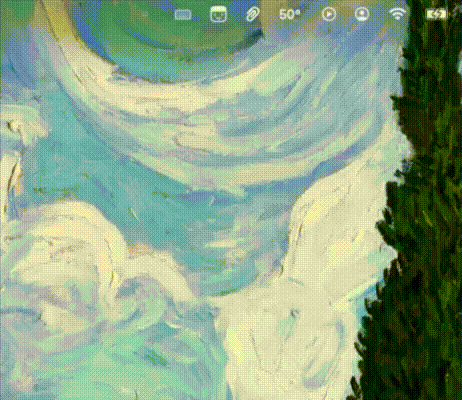

# dirtymac

A native macOS menu bar utility that temporarily locks your keyboard so you can clean it without triggering keys. Mouse and trackpad stay fully responsive.

<p align="center">
  
</p>

## Why

Wiping crumbs out of a MacBook keyboard usually means dragging a Finder window full of garbage characters and accidentally launching apps. dirtymac suppresses every keystroke at the system event-tap level until you click stop. Your trackpad keeps working the entire time.

## Features

- One-click keyboard lock from the menu bar
- Blocks every keyboard input: regular keys, modifiers, **and** brightness / volume / media / F-key controls
- **Basic mode**: mouse and trackpad stay live — click the menu bar icon to release
- **Advanced mode**: optionally freeze the mouse & trackpad too, choose which key classes to block, and set an auto-unlock timer
- Universal hold-Esc emergency exit (3 seconds) — works even in full lockdown
- Guided first-launch onboarding with live Accessibility-permission status
- Status item: single-click opens the popover, right-click shows an Open / Quit menu
- Live elapsed-time display and auto-unlock countdown while locked
- Auto re-enables the event tap if macOS times it out
- Settings with light / dark override and 12-language UI (runtime switching, no relaunch)
- No Dock icon (`LSUIElement`)
- No network access, no analytics, no background daemons

## Install

### Homebrew (recommended)

```bash
brew install --cask erenmalkoc/tap/dirtymac
```

### Manual download

Grab the latest signed & notarized DMG from [Releases](https://github.com/erenmalkoc/dirtymac/releases/latest), then drag `dirtymac.app` to `/Applications`.

## Requirements

- macOS 14 (Sonoma) or later
- Xcode 15 or later (to build from source)

## Build from source

```bash
git clone https://github.com/erenmalkoc/dirtymac.git
cd dirtymac
open dirtymac.xcodeproj
```

Build and run the `dirtymac` scheme (`⌘R`) targeting *My Mac*.

## Permissions

dirtymac needs **Accessibility** access to intercept keyboard events. On first launch:

1. Click the menu bar icon, then **Grant Access** in the popover.
2. macOS will prompt you to enable dirtymac in **System Settings → Privacy & Security → Accessibility**.
3. Toggle dirtymac on and reopen the popover.

The accessibility tap only swallows events; nothing is recorded, logged, or forwarded.

## How it works

dirtymac creates a `CGEventTap` at the session level (`.cgSessionEventTap`). The mask is built from the active lock configuration: `keyDown` and `keyUp` are always present; `flagsChanged`, `kCGEventSystemDefined` (subtype 8 — the aux-control channel that brightness, volume, and media keys use), and the mouse / trackpad / scroll types are added when the matching Advanced toggles are on. The callback returns `nil` for events that are meant to be blocked, removing them from the system input queue. By default (Basic mode) mouse and trackpad are not in the mask, so they keep working — including the click that opens the menu and disables the lock. Advanced full lockdown adds them; the universal hold-Esc (3 s) emergency exit and a mandatory auto-unlock timer guarantee the lock can always be released. The power button (`systemDefined` subtype 1) is deliberately allowed through so the user keeps a hardware emergency exit.

If macOS disables the tap (timeout or excessive callback latency), dirtymac re-enables it automatically.

## Project layout

```
dirtymac/
├── dirtymacApp.swift          # @main + AppDelegate: NSStatusItem, popover, onboarding window
├── KeyboardBlocker.swift      # CGEventTap, hold-Esc, auto-unlock, AX permission
├── MenuBarPopoverView.swift   # popover root: navigation, preferences, appearance + locale
├── MainView.swift             # keyboard lock control + inline full-lockdown confirmation
├── SettingsView.swift         # preference models + settings UI (mode, appearance, language)
├── OnboardingView.swift       # 3-step first-launch guided setup
├── GlassComponents.swift      # PowerButton, StatusPill, AppIconView
└── Localizable.xcstrings      # 12-language string catalog
```

## Releasing

Tag-driven. The `release` workflow builds, signs, notarizes, and publishes a stapled DMG on every `v*.*.*` tag push:

```bash
git tag v1.2.3 && git push origin v1.2.3
```

Required GitHub Secrets:

| Secret | What it is |
|---|---|
| `APPLE_TEAM_ID` | Your Apple Developer Team ID |
| `DEVELOPER_ID_P12_BASE64` | `base64 -i devid.p12 \| pbcopy` |
| `DEVELOPER_ID_P12_PASSWORD` | Password you set when exporting the .p12 |
| `NOTARY_KEY_BASE64` | `base64 -i AuthKey_XXXX.p8 \| pbcopy` |
| `NOTARY_KEY_ID` | Key ID from App Store Connect → Users and Access → Keys |
| `NOTARY_ISSUER_ID` | Issuer ID from the same page |

For local releases, run [`scripts/release.sh`](scripts/release.sh) with the same env vars (cert can stay in your login keychain).

## Privacy

dirtymac runs entirely on your Mac:

- No network connections
- No telemetry, analytics, or crash reporting
- No background processes — quitting the app fully releases the keyboard

The hardened runtime is enabled. The app is unsandboxed because the system event tap requires it.

## Contributing

Issues and pull requests welcome. Please keep changes scoped — the goal is to stay a small, focused utility.

## License

[MIT](LICENSE) © 2026 erenium.tech
